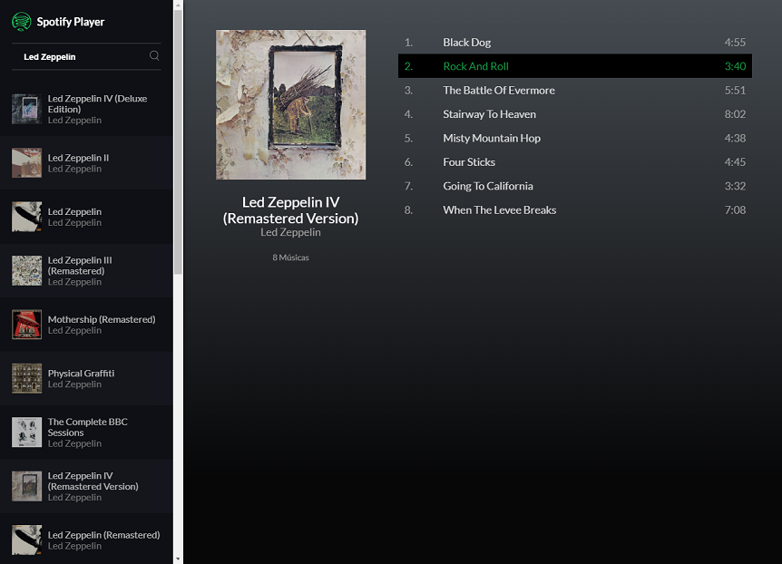

# Spotify Player

 

> This application uses the [spotify-wrapper-api](https://github.com/FranciscoKnebel/spotify-wrapper-api) library to get album data from Spotify.

## Browser Support

This Application relies on [Fetch API](https://fetch.spec.whatwg.org/). And this API is supported in the following browsers.

 |  |  |  |  |
--- | --- | --- | --- | --- |
39+ ✔ | 42+ ✔ | 29+ ✔ | 10.1+ ✔ | Nope ✘ |

## How to Run

1. Create your Spotify Web API access token at [Spotify](https://developer.spotify.com/web-api/).
1. Clone the repository.
3. Add your token on [src/spotify.js](src/spotify.js). This token has a short life, so you will need to renew it.
4. Install the dependencies with `npm install`.
5. Run the application with `npm start`.

## Contributing

Please read [CONTRIBUTING.md](CONTRIBUTING.md) for details on our code of conduct, and the process for submitting pull requests to us.

## Versioning

We use [SemVer](http://semver.org/) for versioning. For the versions available, see the [tags on this repository](https://github.com/FranciscoKnebel/spotify-wrapper-api/tags).

## Authors

| |
|:---------------------:|
|  [Francisco Knebel](https://github.com/FranciscoKnebel/)   |

See also the list of [contributors](https://github.com/FranciscoKnebel/spotify-wrapper-api/contributors) who participated in this project.

## License

This project is licensed under the MIT License - see the [LICENSE.md](LICENSE.md) file for details
